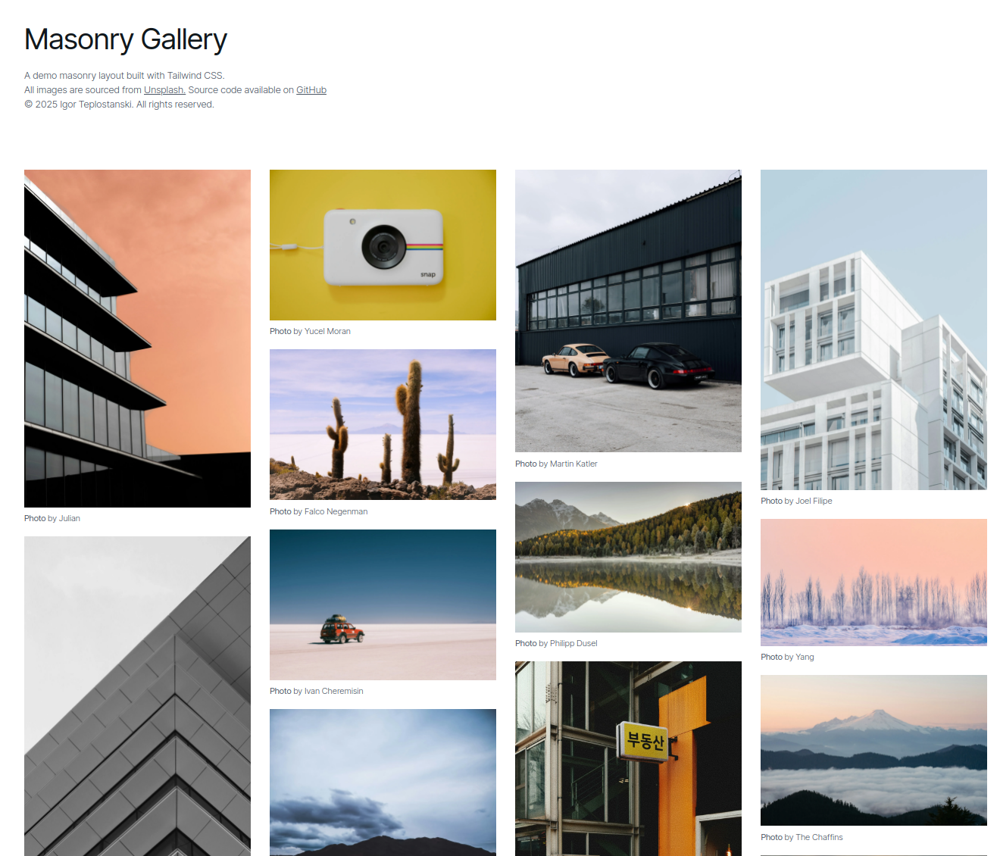

# Masonry Gallery

Галерея изображений с плиточной раскладкой в стиле Pinterest. При клике на изображение открывается полноэкранное модальное окно с возможностью перелистывания свайпом.



## Демо

[Masonry Gallery](https://teplostanski.github.io/masonry-gallery-tailwind/)

## Стек

- **React**
- **TypeScript**
- **Vite**
- **Tailwind CSS**
- **NextUI**
- **Swiper**


## Особенности

- Адаптивная раскладка `masonry`
- Полноэкранный просмотр
- Поддержка жестов
- Адаптивный дизайн
- Современный интерфейс

## Запуск локально

1. Клонируйте репозиторий:
```bash
git clone https://github.com/teplostanski/masonry-gallery-tailwind.git
cd masonry-gallery-tailwind
```

2. Установите зависимости:
```bash
npm install
```

3. Запустите сервер разработки:
```bash
npm run dev
```

4. Откройте [http://localhost:5173](http://localhost:5173) в браузере.

## Сборка

Для сборки проекта:
```bash
npm run build
```
